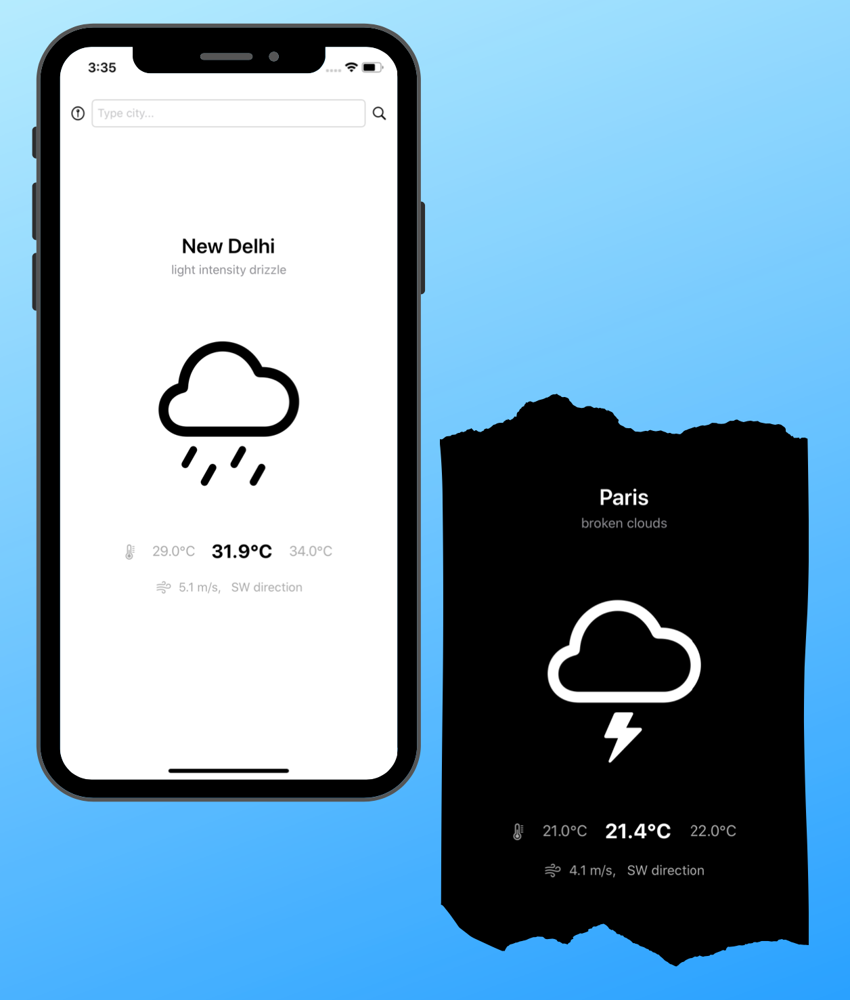

# Weather-App 🌤

 

## Snapshots

## Features
- [x] Get weather data instantaneously
- [x] Fetch user location to predict weather
- [x] Search by city name
- [x] Supports Dark mode 
- [x] OpenWeather API
